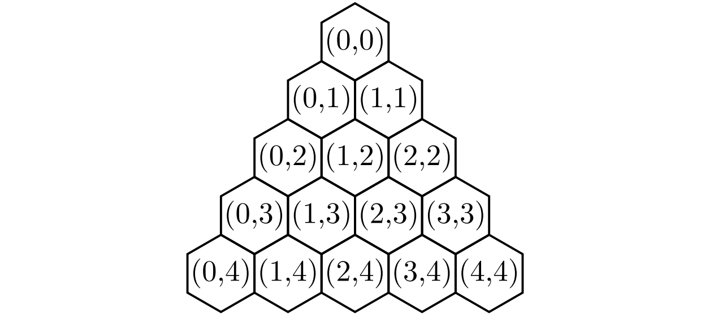

# multicolor-peg-solitaire

This project is designed to provide solutions for two distinct problems in peg solitaire in multiple colors:
* Given a board of arbitrary size and an arbitrary number of colors, provide a solution path (or determine that no solution path exists).
* Given a specific size for a board in three colors, generate and solve all possible starting board states (up to symmetry).

## How to use

Once downloaded, this project can be modified via variables in src/Main.java (Main method).
```
int[][] boardTemp = {
					{0, 0, 0, 0, 0},
					{1, 1, 0, 0, 0},
					{1, 1, 1, 0, 0},
					{1, 1, 1, 1, 0},
					{1, 1, 1, 1, 1}
			};
			
```
*Example of modifiable board variable in Main()*

Project structure:
* `src/Main.java` - Main class
* `src/MulticolorSolver.java` - Class containing functionality to solve a board for any size / any # of colors.
* `src/Move.java` - Helper class to represent a move on a board.
* `src/MultiboardSolver.java` - Streamlined version of MulticolorSolver.java. Used in solving a large number of boards in specifically 3 colors. Reduced method reference and object overhead.

A list of how to execute various featues is described below.


## Solving boards

The following variables are intended to be changed by the user.

* `boolean solveAllBoards` - boolean indicating whether the user wants a single board to be solved, or wants all possible boards of a certain size in three colors to be solved.

     TRUE = all boards solved, FALSE = single board solved. Default == FALSE.

* `int[][] boardTemp` - 2D array representing a board to be solved.

     A triangle board is stored via left alignment, which each successive row containing one more element than the last. User can set individual elements, and specify as many starting vacancies as desired.

* `MulticolorSolver solve = new MulticolorSolver(boardTemp, 5, "singularSolutions.txt", true, false, false, false);` - Constructor for MulticolorSolver.

     Format: (int[][], int, String, boolean, boolean, boolean, boolean)
     Parameters: (board, board size, file name for solutions, animate in console, output to file, restrict to N jumps, compute vector)

     The user can change each individual parameter to get the desired functionality.

* `int boardSize` - Integer representing the size of board for all possible solutions in three colors..

     Default == 5.

* `MultiboardSolver m = new MultiboardSolver(newBoard, "solutions.txt");` - Constructor for MultiboardSolver.

     Format: (int[][], String)
     Parameters: (board, file name for solutions)

     The user can change each individual parameter to get the desired functionality.

* `public static int[][] setHoles = {{0,0}, {0, 1}, {0, 2}, {1, 2}};` - 2D array for the positions of the starting vacancies.

     User can change these values to observe different starting vacancies.


Set these parameters to the desired value in src/Main.java.

## Example - setup

The following example is for a monochromatic T<sup>5</sup> board in 5 colors.

* `boardTemp` is set as follows:
```
int[][] boardTemp = {
					{0, 0, 0, 0, 0},
					{1, 1, 0, 0, 0},
					{1, 1, 1, 0, 0},
					{1, 1, 1, 1, 0},
					{1, 1, 1, 1, 1}
			};
```
* Parameters for the constructor are set:
```
//board, colors, filename, animate in console, output to file, restrict to only jumps with form (n-1), computeVector
MulticolorSolver solve = new MulticolorSolver(boardTemp, 5, "singularSolutions.txt", true, false, false, false);
```
Ready to go!

## Example - output

Our parameters were set such that the board is size 5, the number of colors is 5, and the solution path will be animated in the console.

The solution path is output as follows:
```
[(0, 2)(0, 1)(0, 0)]
[(0, 0)(0, 1)(0, 2)]
[(0, 2)(0, 1)(0, 0)]
[(0, 0)(0, 1)(0, 2)]
[(2, 2)(1, 1)(0, 0)]
[(0, 0)(1, 1)(2, 2)]
[(2, 2)(1, 1)(0, 0)]
[(0, 0)(1, 1)(2, 2)]
[(0, 3)(0, 2)(0, 1)]
[(0, 2)(0, 1)(0, 0)]
[(0, 0)(0, 1)(0, 2)]
[(2, 3)(1, 2)(0, 1)]
[(0, 2)(0, 1)(0, 0)]
[(0, 0)(0, 1)(0, 2)]
[(1, 3)(1, 2)(1, 1)]
[(2, 2)(1, 1)(0, 0)]
[(0, 0)(1, 1)(2, 2)]
[(2, 2)(1, 1)(0, 0)]
[(0, 0)(1, 1)(2, 2)]
[(3, 3)(2, 2)(1, 1)]
[(2, 2)(1, 1)(0, 0)]
[(1, 1)(1, 2)(1, 3)]
[(1, 3)(1, 2)(1, 1)]
[(1, 1)(1, 2)(1, 3)]
[(0, 2)(1, 2)(2, 2)]
[(1, 3)(1, 2)(1, 1)]
[(1, 1)(1, 2)(1, 3)]
[(2, 4)(1, 3)(0, 2)]
[(0, 4)(1, 4)(2, 4)]
[(1, 4)(1, 3)(1, 2)]
[(1, 3)(1, 2)(1, 1)]
[(1, 1)(1, 2)(1, 3)]
[(3, 4)(2, 4)(1, 4)]
[(2, 4)(1, 4)(0, 4)]
[(0, 2)(1, 3)(2, 4)]
[(2, 2)(1, 2)(0, 2)]
[(1, 3)(1, 2)(1, 1)]
[(0, 0)(1, 1)(2, 2)]
[(2, 2)(1, 1)(0, 0)]
[(0, 0)(1, 1)(2, 2)]
[(1, 1)(1, 2)(1, 3)]
[(1, 3)(1, 2)(1, 1)]
[(1, 1)(2, 2)(3, 3)]
[(0, 2)(1, 2)(2, 2)]
[(2, 2)(1, 2)(0, 2)]
[(0, 2)(1, 2)(2, 2)]
[(1, 4)(2, 4)(3, 4)]
[(3, 4)(2, 4)(1, 4)]
[(1, 4)(2, 4)(3, 4)]
[(4, 4)(3, 4)(2, 4)]
[(2, 2)(3, 3)(4, 4)]
[(3, 4)(2, 4)(1, 4)]
[(0, 4)(1, 4)(2, 4)]
[(1, 4)(2, 4)(3, 4)]
[(3, 4)(2, 4)(1, 4)]
[(1, 4)(2, 4)(3, 4)]
[(4, 4)(3, 4)(2, 4)]
[(3, 4)(2, 4)(1, 4)]
```
Each entry in this solution path is a list of coordinates of the jump in the format (starting peg, jumped peg, ending peg). 

On a triangle board, the skew-coordinates are labels, (x, y), with the convention that the top vertex is labeled (0, 0), the left-most vertex on each row is given the value x = 0, x-values increment as you move right, and y-values increment as you move down:



So, for each move listed in the solution path, we can perform the move on the board and see the solution.

Obviously, playing this out for oneself is laborious. To see an example of the solution path animated in the console, see exampleSolution.txt.

## TODO

* MultiboardSolver can be streamlined further by implementing a hashtable instead of individually comparing each 2D array.
* Ensure that MulticolorSolver is not making redundant checks via the Move object.

## Achknowledgements

I would like to thank Dr. Lauren Grimley at the University of Oklahoma for introducing me to the problem of peg solitaire in multiple colors. It's been a pleasure to work on!